# 前端开发学习总结


## 我的思维导图





---


## 一、第一次课堂学习总结（基础前端+Git）

### 1.1 本地存储（localStorage & sessionStorage）

前端本地存储核心两种方式，无需与服务器交互，核心区别在于存储生命周期和作用范围。

- localStorage：长期存储，需手动删除，同一域名下所有页面可共享，无跨域权限。
- sessionStorage：临时存储，仅当前页面会话有效，关闭标签页自动清除，同域名不同标签页不可共享。
- 存储复杂数据：仅支持字符串，存储对象/数组需用 `JSON.stringify()` 转换，读取用 `JSON.parse()` 解析。
- 注意点：不支持二进制数据，超出 5MB 建议使用 IndexedDB。

```js
// 核心示例
const userInfo = { uname: 'teal', age: 20 };
localStorage.setItem('user', JSON.stringify(userInfo)); // 存储
const getuser = JSON.parse(localStorage.getItem('user')); // 读取
sessionStorage.setItem('token', 'abc123'); // 用法与 localStorage 一致，生命周期不同
```

### 1.2 BOM（浏览器对象模型）

操作浏览器窗口和页面的核心对象，重点考点如下：

- location：核心考点，用于获取/操作地址栏信息（URL、跳转、刷新等）。
- navigator：获取浏览器相关信息（用户代理、版本等）。
- history：操作浏览器历史记录（前进、后退）。
- screen：获取屏幕尺寸等信息。

```js
// location 核心操作
console.log(location.href); // 获取完整 URL
location.href = 'https://www.example.com'; // 跳转页面
location.reload(); // 刷新页面
```

### 1.3 DOM（文档对象模型）

操作 HTML 文档结构的接口，核心是元素操作和事件处理。

#### 1.3.1 DOM 元素操作

- 创建元素：`document.createElement(标签名)`（唯一正确方式）。
- 获取元素：`document.querySelector(选择器)`（单个）、`document.querySelectorAll(选择器)`（所有，类数组）；父元素子元素用 `parent.children[索引]`（推荐）。
- 添加元素：`parent.appendChild(子元素)`（添加到末尾）。

```js
// 核心示例
const li = document.createElement('li');
li.textContent = '新列表项';
document.querySelector('ul').appendChild(li);
```

#### 1.3.2 DOM 事件

- DOMContentLoaded：DOM 构建完成触发（不等待资源加载）；onload：页面所有资源加载完毕触发。
- 事件冒泡：从触发元素向上传播，用 `e.stopPropagation()` 阻止。
- 阻止默认行为：`e.preventDefault()`（如阻止表单提交）。
- 事件委托：绑定父元素，监听所有子元素（含新增），性能更优。

```js
// 事件委托核心示例
document.querySelector('ul').addEventListener('click', (e) => {
  if (e.target.tagName === 'LI') console.log('点击 li：', e.target.textContent);
});
```

### 1.4 Git 版本控制

分布式版本控制系统，核心命令及规范如下：

#### 1.4.1 Git 基础操作

- 创建仓库：`git init`（本地）、`git clone 仓库地址`（远程克隆）。
- 配置：`git config --list`（查看）、`git config --global` 用户名/邮箱（全局设置）。
- 提交历史：`git log`（基础）、`git log --graph`（分支图）。
- 提交规范：feat（新增）、fix（修复）、perf（优化）、chore（构建相关）。

#### 1.4.2 分支管理

- 查看分支：`git branch`（本地）、`git branch -a`（本地+远程）。
- 合并分支：`git merge 目标分支`；HEAD 默认指向当前分支最后一次提交。

#### 1.4.3 冲突解决与暂存

- 冲突查看：`git diff`（差异）、`git status`（文件列表）。
- 放弃修改：`git checkout 文件名`；暂存：`git stash`；撤销提交：`git reset HEAD~1`。

#### 1.4.4 远程仓库交互

- 拉取：`git pull`；推送：`git push`；查看文件历史：`git log 文件名`。

```bash
# 完整提交流程（核心）
git add . && git commit -m "fix: 修复登录按钮问题"
git pull origin main && git push origin main
```

### 1.5 HTML 基础

核心考点：语义化标签、表单元素、标签属性。

- 语义化标签：`<header>`（头部）、`<aside>`（侧边栏）、`<video>`（视频，需加 `controls` 属性）。
- 表单元素：`<select>`（下拉框）、`<input type="radio">`（单选，同组 `name` 一致）、`<form>`（默认 get 提交）。
- 核心属性：`<meta charset="UTF-8">`（编码）、``（图片，`alt` 为备用提示）。
- 单标签：``、`<input>`、`<meta>`；根元素：`<html>`（包含 head 和 body）。

### 1.6 CSS 基础

核心考点：选择器优先级、盒子模型、核心样式属性。

#### 1.6.1 选择器优先级

- 顺序（从高到低）：`!important` > 行内样式 > ID 选择器 > 类/属性选择器 > 元素选择器；继承样式优先级最低。

#### 1.6.2 盒子模型

- content-box（默认）：width 仅含内容区；border-box（常用）：width 含内容区、border、padding。

#### 1.6.3 核心样式属性

- filter（模糊等效果）、z-index（层叠顺序，需定位）、transition（过渡效果）。
- `text-overflow: ellipsis`（文本省略，需配合 `white-space: nowrap` 和 `overflow: hidden`）。
- position：static（默认）、relative、absolute、fixed；`display: none`（隐藏不占位置）。

### 1.7 JavaScript 基础

核心考点：对象引用、函数返回值、逻辑运算、数组操作。

- 对象引用：赋值为引用传递，修改赋值后对象会影响原对象。
- 函数返回值：无 return 则返回 `undefined`；return 可单独用于结束函数。
- 逻辑运算：`&&`（左真返右，左假返左）；`||`（左真返左，左假返右）。
- 数组循环：避免 `i <= arr.length`，会导致越界；非数字与数字运算返回 `NaN`。

---

## 二、第二次课堂学习总结（AJAX+HTTP+Webpack+Koa+TypeScript）

### 2.1 AJAX（异步 JavaScript 和 XML）

核心：不刷新页面与服务器异步交互，基于 XMLHttpRequest 或 axios。

#### 2.1.1 核心操作

- 响应类型：支持 text、json、xml，不支持 html；终止请求：`xhr.abort()`。
- 请求头：`xhr.setRequestHeader(键, 值)`（send 前设置）；响应解析：`JSON.parse(xhr.responseText)`。

#### 2.1.2 跨域请求

- 服务端设置 `Access-Control-Allow-Origin`；前端用 Webpack 的 `devServer.proxy` 配置代理。

```js
// 原生 AJAX 核心示例
const xhr = new XMLHttpRequest();
xhr.open('GET', 'https://api.example.com/data', true);
xhr.setRequestHeader('Content-Type', 'application/json');
xhr.onload = () => {
  if (xhr.status >= 200 && xhr.status < 300) console.log(JSON.parse(xhr.responseText));
};
xhr.send();
```

### 2.2 HTTP 协议

核心考点：缓存、状态码、请求/响应头、代理。

#### 2.2.1 HTTP 缓存

- Cache-Control: max-age=3600（缓存 1 小时）；ETag、Last-Modified（判断资源是否修改）。

#### 2.2.2 HTTP 状态码

- 400（请求错误）、401（认证失败）、403（无权限）、404（资源不存在）、302（临时重定向）、405（请求方式错误）。

#### 2.2.3 核心请求/响应头

- Content-Type（数据格式）、Access-Control-Allow-Origin（跨域）、Origin（请求来源）。

#### 2.2.4 HTTP 代理与 Whistle

- Whistle 启动：`w2 start`；HTTPS 代理需安装证书。

### 2.3 Webpack 打包工具

核心：打包前端资源，核心配置及功能如下：

#### 2.3.1 核心配置

- mode（development/production）、resolve（路径解析）、devServer.proxy（跨域代理）。
- Loader：处理不同文件（css-loader、babel-loader）；Plugin：扩展功能（html-webpack-plugin 注入 JS/CSS）。

```js
// webpack 核心配置（简化）
const HtmlWebpackPlugin = require('html-webpack-plugin');
module.exports = {
  mode: 'development',
  entry: './src/index.js',
  devServer: { proxy: { '/api': { target: 'https://api.example.com', changeOrigin: true } } },
  module: { rules: [{ test: /\.css$/, use: ['style-loader', 'css-loader'] }] },
  plugins: [new HtmlWebpackPlugin({ template: './public/index.html' })],
};
```

### 2.4 TypeScript 基础

JS 超集，核心考点：泛型、可选属性。

- 泛型：不指定具体类型，使用时再定义，提高复用性；可选属性：用 `?` 定义，可传可不传。

```ts
// 核心示例
function getValue<T>(value: T): T {
  return value;
}
interface User {
  name: string;
  age?: number;
} // 可选属性
```

### 2.5 Koa 框架

Node.js Web 框架，核心：中间件洋葱模型、ctx 对象、中间件使用。

- 中间件顺序：先执行前半部分，再执行后续中间件，最后执行后半部分（`await next()` 后）。
- ctx：`ctx.request`（请求）、`ctx.response`（响应）；koa-body 解析请求体，koa-static 托管静态资源。

### 2.6 前端埋点（GIF 方案）

- 优势：无需等待响应、可跨域、体积小；注意：页面卸载时请求可能被取消。

### 2.7 IndexedDB

localStorage 替代方案，适用场景：数据超 5MB、存储二进制数据、复杂查询、异步读写。

---

## 三、第三次课堂学习总结（React+Redux+性能优化）

### 3.1 React 基础（Hooks+组件通信+路由）

#### 3.1.1 React Hooks 核心用法

- **useState** — 管理状态，更新异步、批量更新，依赖前状态需用函数形式。
- **useEffect** — 处理副作用，依赖数组控制执行时机，返回函数清理副作用。
- **useRef** — 获取 DOM 或保存可变值（不触发渲染）。
- **useMemo** — 缓存计算结果；**useCallback** — 缓存函数（配合 React.memo 优化）。
- **useContext** — 跨组件传值，配合 createContext；自定义 Hooks：命名以 use 开头，复用逻辑。

```js
// 核心示例
const [count, setCount] = useState(0);
useEffect(() => {
  const timer = setInterval(() => setCount((prev) => prev + 1), 1000);
  return () => clearInterval(timer);
}, []);
const inputRef = useRef(null);
inputRef.current.focus();
```

#### 3.1.2 React 组件通信

- 父子通信：父传子（props），子传父（父传回调函数）。
- 兄弟通信：状态提升到共同父组件；跨层级：useContext + createContext；非相关组件：Redux。

#### 3.1.3 React Router

核心：SPA 页面跳转，考点：路由组件、传参、路由守卫。

- 核心组件：BrowserRouter、Routes、Route、Link、useNavigate（编程式导航）。
- 路由传参：params（`/user/:id`，useParams 获取）、query（`?name=张三`，useSearchParams 获取）、state（useLocation 获取）。
- 路由守卫：用 Navigate 重定向；嵌套路由：用 Outlet 渲染子路由。

### 3.2 Redux（状态管理）

核心：全局状态管理，考点：核心概念、工作流程、异步中间件。

#### 3.2.1 核心概念

- Store：全局状态容器，提供 getState、dispatch、subscribe 方法。
- Action：描述状态变化，含 type（必填）和 payload（可选）。
- Reducer：纯函数，接收 prevState 和 action，返回新状态（禁止修改原状态）。
- 中间件：redux-thunk 处理异步；React-Redux：Provider（提供 Store）、useSelector（获取状态）、useDispatch（获取 dispatch）。

```js
// 核心示例（异步 Action）
export const fetchUser = (userId) => async (dispatch) => {
  const res = await fetch(`/user/${userId}`);
  dispatch({ type: 'SET_USER', payload: await res.json() });
};
// Reducer
const rootReducer = (prevState = { user: null }, action) => {
  switch (action.type) {
    case 'SET_USER':
      return { ...prevState, user: action.payload };
    default:
      return prevState;
  }
};
```

### 3.3 React 性能优化

核心：减少不必要的重新渲染，重点优化手段：

- 组件优化：React.memo（缓存组件）、useMemo（缓存计算）、useCallback（缓存函数）。
- 渲染优化：列表 key 唯一（禁止用 index）、React.lazy + Suspense（懒加载）、虚拟列表（大量数据）。
- 其他：避免无效状态更新、清理副作用、拆分复杂组件。

### 3.4 常见易错点总结

- useState 更新异步，不可立即获取最新状态；useEffect 依赖数组需完整。
- Reducer 禁止修改原状态，需返回新对象；React Router v6 中 Route 必须包裹在 Routes 中。
- 列表 key 需唯一稳定，禁止用 index。
