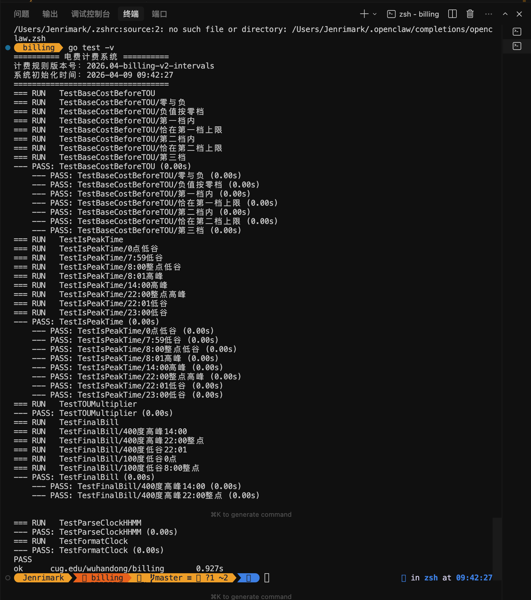
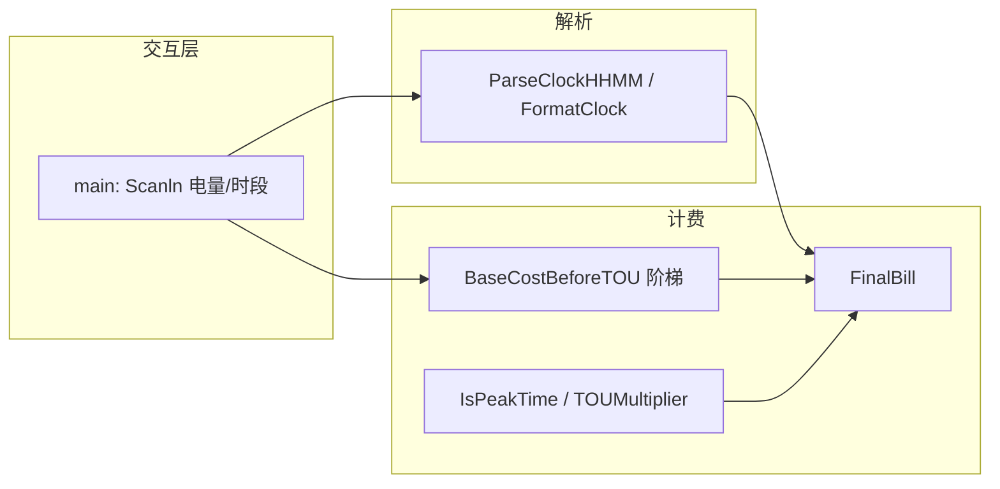

# 阶梯电价与峰谷计费 — Week04 作业

## 项目基本信息

| 字段 | 内容 |
|------|------|
| 姓名 | 吴汉东 |
| 学校 | 中国地质大学（武汉） |
| 学号 | 20231003912 |
| 项目 | 电费计费系统（Go：阶梯电价 + 峰谷时段因子 + 交互式账单 + 单元测试） |
| 语言与模块 | Go 1.22；模块路径 `cug.edu/wuhandong/billing`（见 `go.mod`） |
| 运行程序 | 在 `billing` 目录执行 `go run .`，按提示输入用电量与时点 |
| 运行测试 | 同上目录执行 `go test -v`（或 `go test -v ./...`） |
| 提交结构 | 含 `go.mod`、`billing.go`、`billing_test.go`、`README.md`、`assets/`（测试通过截图） |

**《作业要求4》对照**：学校/姓名/学号 → 上表；完成的功能 → [开发任务索引](#开发任务索引)；关键逻辑思路 → [核心技术实现](#核心技术实现)、[设计思路与架构](#设计思路与架构)；测试用例及说明 → [测试用例说明](#测试用例说明)；测试通过截图 → `assets/测试结果.png`，并在 [单元测试结果](#单元测试结果)（用例说明之前）展示；阶梯电价与峰谷边界难点 → [遇到的问题与解决思路](#遇到的问题与解决思路)。流程图 → `assets/流程图.svg`，见 [设计思路与架构](#设计思路与架构)。

---

## 开发任务索引

### 基础要求（对照《作业要求4》二、三）

| # | 要求摘要 | 实现说明 | 状态 |
|---|----------|----------|------|
| 1 | 阶梯电价三档（0–200、200–400、400+）与单价常量 | `Tier1UpperKWh` / `Tier2UpperKWh`、`PriceTier1`～`PriceTier3`；`BaseCostBeforeTOU` 分段累加 | ✅ |
| 2 | 峰谷调节：高峰总费率 +10%、低谷 −20% | `PeakFactor` / `ValleyFactor`；`TOUMultiplier` 乘在阶梯总价上（见 `FinalBill`） | ✅ |
| 3 | `init()` 打印计费规则版本号与系统初始化时间 | `BillingRuleVersion`、`systemInitTime`；`init()` 内 `fmt` 输出横幅 | ✅ |
| 4 | 使用 `const` 定义档位与浮点参数 | 阶梯阈值与单价、峰谷因子、时段边界（`PeakRange*`、`MinutesPerHour`）、版本号等均用常量 | ✅ |
| 5 | 逻辑拆分为多个函数 | `BaseCostBeforeTOU`、`minutesSinceMidnight`、`IsPeakTime`、`TOUMultiplier`、`FinalBill`、`ParseClockHHMM`、`FormatClock` 等 | ✅ |
| 6 | `main` 循环：引导输入用电量、时段，打印账单明细格式 | `for` 循环 + `fmt.Scanln`；输出「--- 账单明细 ---」三行数据 | ✅ |
| 7 | 针对计算函数编写单元测试 | `billing_test.go`：表驱动、`t.Run` 子测试、`floatEq` 浮点容差 | ✅ |
| 8 | 目录规范：`go.mod`、`billing.go`、`billing_test.go`、`README.md`、`assets/` | 与本 README「项目结构」一致 | ✅ |


---

## 核心技术实现

### 1. 阶梯基础电费（峰谷前）

负值或零用电量按 0 处理；否则按三档分段：第一档全额 × `PriceTier1`，跨档部分 × 对应单价，第三档对超出 400 度的部分 × `PriceTier3`。

> **搜索定位**：`BaseCostBeforeTOU`

```go
// billing.go（节选）
func BaseCostBeforeTOU(kwh float64) float64 {
	if kwh <= 0 {
		return 0
	}
	u := kwh
	var cost float64
	if u <= Tier1UpperKWh {
		cost = u * PriceTier1
	} else if u <= Tier2UpperKWh {
		cost = Tier1UpperKWh*PriceTier1 + (u-Tier1UpperKWh)*PriceTier2
	} else {
		mid := Tier2UpperKWh - Tier1UpperKWh
		cost = Tier1UpperKWh*PriceTier1 + mid*PriceTier2 + (u-Tier2UpperKWh)*PriceTier3
	}
	return cost
}
```

### 2. 峰谷判定：当日分钟数与 (8:00, 22:00］

将时点转为当日 0:00 起的分钟数 `m`，高峰当且仅当 `480 < m <= 1320`（即大于 8:00、小于等于 22:00）。

> **搜索定位**：`IsPeakTime`、`minutesSinceMidnight`

```go
// billing.go（节选）
func minutesSinceMidnight(hour, minute int) int {
	return hour*MinutesPerHour + minute
}

func IsPeakTime(hour, minute int) bool {
	m := minutesSinceMidnight(hour, minute)
	return m > PeakRangeStartExclusiveMin && m <= PeakRangeEndInclusiveMin
}
```

### 3. 最终电费：阶梯总价 × 时段因子

**最终电费 = `BaseCostBeforeTOU` × `TOUMultiplier`**，与「对总费率增减」语义一致（先算阶梯总额，再乘峰谷因子）。

> **搜索定位**：`FinalBill`

```go
// billing.go（节选）
func FinalBill(kwh float64, hour, minute int) float64 {
	return BaseCostBeforeTOU(kwh) * TOUMultiplier(hour, minute)
}
```

### 4. 时段解析与展示格式

`ParseClockHHMM` 用 `strings.Split` + `strconv.Atoi` 解析 `H:MM` / `HH:MM` 并校验范围；`FormatClock` 用 `%02d:%02d` 输出账单中的时点字符串。

> **搜索定位**：`ParseClockHHMM`、`FormatClock`

### 5. `main` 交互循环

持续读取用电量（拒绝负数）与时点字符串；解析失败打印原因并重新输入；成功则按作业要求打印账单块。

> **搜索定位**：`func main`

### 6. 单元测试（表驱动 + 子测试）

`TestBaseCostBeforeTOU`、`TestIsPeakTime`、`TestFinalBill` 等用切片用例 + `t.Run`；金额比较通过 `floatEq`（`math.Abs` 小于 epsilon）避免 `float64` 直接 `==`。

> **搜索定位**：`billing_test.go` 中 `Test` 前缀函数、`floatEq`

---

## 单元测试结果

在仓库内路径 `week04/homework/billing/`（或已 `cd` 到 `billing`）执行 `go test -v`，终端全部为 **PASS** 时的截图如下；源文件路径：**`assets/测试结果.png`**（更新截图时覆盖该文件即可）。



---

## 测试用例说明

（对应《作业要求4》：列出测试用例及其功能说明。）下列与 `billing_test.go` **逐条一致**：先说明被测函数职责，再列出每个子测试（`t.Run` 名称）的**输入、期望输出、功能说明**。单价与常量以 `billing.go` 为准：`PriceTier1=0.5`、`PriceTier2=0.8`、`PriceTier3=1.2`，`PeakFactor=1.10`，`ValleyFactor=0.80`。

**金额比较**：凡涉及 `float64` 的相等判断，测试中均通过 `floatEq`（`|a-b| < 1e-9`）完成，避免二进制浮点误差导致误判。

---

### `TestBaseCostBeforeTOU` — 峰谷前的阶梯电费

**被测函数**：`BaseCostBeforeTOU(kwh)`，仅根据用电量按三档计价，**不含**峰谷因子。

| 子测试名称（`t.Run`） | 输入 `kwh` | 期望 `BaseCostBeforeTOU`（元） | 功能说明 |
|----------------------|------------|--------------------------------|----------|
| 零与负 | `0` | `0` | 零用电量不产生基础电费 |
| 负值按零档 | `-10` | `0` | 负电量与业务不符时归一为 0，避免负账单 |
| 第一档内 | `100` | `50`（100×0.5） | 仅落在第一档（0–200）时全额 × 第一档单价 |
| 恰在第一档上限 | `200` | `100`（200×0.5） | 第一档上边界 200 度：全部为第一档电量 |
| 第二档内 | `300` | `180`（200×0.5 + 100×0.8） | 跨 200：前 200 度一档价，超出部分二档价 |
| 恰在第二档上限 | `400` | `260`（200×0.5 + 200×0.8） | 第二档上边界 400 度：前 200 一档、接下来 200 二档 |
| 第三档 | `500` | `380`（260 + 100×1.2） | 超过 400 的部分按第三档单价累加 |

---

### `TestIsPeakTime` — 高峰 (8:00, 22:00］的判定

**被测函数**：`IsPeakTime(hour, minute)`，内部用当日 0 点起的分钟数，**高峰**当且仅当 `480 < 分钟数 ≤ 1320`。

| 子测试名称 | 输入时刻 | 期望 `IsPeakTime` | 功能说明 |
|------------|----------|-------------------|----------|
| 0点低谷 | 0:00 | `false` | 午夜属低谷时段 |
| 7:59低谷 | 7:59 | `false` | 8:00 之前均为低谷 |
| 8:00整点低谷 | 8:00 | `false` | 区间左开：8:00 整点不算高峰 |
| 8:01高峰 | 8:01 | `true` | 刚过 8:00 即进入高峰 |
| 14:00高峰 | 14:00 | `true` | 典型下午高峰 |
| 22:00整点高峰 | 22:00 | `true` | 区间右闭：22:00 整点仍算高峰 |
| 22:01低谷 | 22:01 | `false` | 过 22:00 整点后进入低谷 |
| 23:00低谷 | 23:00 | `false` | 深夜低谷 |

---

### `TestTOUMultiplier` — 峰谷乘子与 `IsPeakTime` 一致

**被测函数**：`TOUMultiplier(hour, minute)`，高峰返回 `PeakFactor`，否则返回 `ValleyFactor`。

| 断言（代码中的调用） | 期望返回值 | 功能说明 |
|---------------------|------------|----------|
| `TOUMultiplier(14, 0)` | `1.10`（`PeakFactor`） | 典型高峰时刻乘子正确 |
| `TOUMultiplier(22, 0)` | `1.10` | 22:00 整点仍为高峰，乘子为高峰因子 |
| `TOUMultiplier(22, 1)` | `0.80`（`ValleyFactor`） | 22:01 已非高峰，乘子切换为低谷因子 |
| `TOUMultiplier(8, 0)` | `0.80` | 8:00 整点为低谷，乘子为低谷因子 |

---

### `TestFinalBill` — 阶梯基础 × 时段乘子

**被测函数**：`FinalBill(kwh, hour, minute)` = `BaseCostBeforeTOU(kwh) × TOUMultiplier(hour, minute)`。

| 子测试名称 | 输入 | 中间量（便于手算） | 期望 `FinalBill`（元） | 功能说明 |
|------------|------|-------------------|------------------------|----------|
| 400度高峰14:00 | 400 度，14:00 | 基础 260，高峰 ×1.1 | `286`（260×1.1） | 跨两档满档 + 典型高峰 |
| 400度高峰22:00整点 | 400 度，22:00 | 基础 260，22:00 仍为高峰 | `286` | 高峰右边界上的计费 |
| 400度低谷22:01 | 400 度，22:01 | 基础 260，低谷 ×0.8 | `208`（260×0.8） | 刚过 22:00 切换为低谷 |
| 100度低谷0点 | 100 度，0:00 | 基础 50，低谷 ×0.8 | `40`（50×0.8） | 仅第一档 + 深夜低谷 |
| 100度低谷8:00整点 | 100 度，8:00 | 基础 50，8:00 为低谷 ×0.8 | `40` | 8:00 整点低谷 + 小电量 |

---

### `TestParseClockHHMM` — 时段字符串解析

**被测函数**：`ParseClockHHMM(s)` → `(hour, minute, err)`。

| 序号 | 输入字符串 | 期望 `(hour, minute)` | 期望 `err` | 功能说明 |
|------|------------|----------------------|------------|----------|
| 1 | `"14:00"` | `(14, 0)` | `nil` | 标准两位小时 |
| 2 | `"8:30"` | `(8, 30)` | `nil` | 个位小时 + 分钟解析 |
| 3 | `"bad"` | （不校验具体值） | **非 `nil`** | 非法格式必须返回错误，避免静默错误计费 |

---

### `TestFormatClock` — 账单时点展示格式

**被测函数**：`FormatClock(hour, minute)`。

| 输入 `(hour, minute)` | 期望字符串 | 功能说明 |
|------------------------|------------|----------|
| `(8, 5)` | `"08:05"` | 小时、分钟均补零到两位，与账单 `Printf` 展示一致 |

---

## 设计思路与架构

计算链路由下至上：**解析合法时点 → 判断是否高峰 → 取乘子 → 与阶梯基础电费相乘得到最终金额**。`init` 仅负责启动时展示版本与时间，不参与计费。`main` 只负责 I/O 与调用上述纯函数，便于单测覆盖核心逻辑。



同一套架构的导出图（源文件 **`assets/流程图.svg`**，可在不支持 Mermaid 的查看器中对照）：



---

## 项目结构

```
week04/homework/billing/
├── README.md           # 本说明（提交必读）
├── go.mod              # module cug.edu/wuhandong/billing
├── billing.go          # 常量、init、计费函数、main
├── billing_test.go     # 单元测试
└── assets/
    ├── 流程图.svg      # 架构流程图（与 README 中 Mermaid 对应）
    └── 测试结果.png    # `go test -v` 全部 PASS 截图（README「单元测试结果」引用）
```

---

## 使用说明

### 老师批改（运行程序）

```bash
cd week04/homework/billing
go run .
```

按提示输入用电量（如 `400.00`）与时段（如 `14:00`），应输出「--- 账单明细 ---」及电量、时点、最终电费。

### 运行单元测试

```bash
cd week04/homework/billing
go test -v
```

确认终端输出全部为 **PASS** 后，可将界面截图保存为 **`assets/测试结果.png`** 并覆盖原文件；README 中已在 [单元测试结果](#单元测试结果)（用例说明之前）展示该图，满足作业「`billing` 下 `assets` + 文档展示」要求。

### 视频提交（摘要）

- 命名：`吴汉东_20231003912_billing.mp4`（姓名、学号按学校要求填写）。  
- 内容建议：口述学校/姓名/学号末四位与日期 → 简述阶梯与峰谷思路 → `go run .` 演示 → `go test -v` 演示 → 简要谈难点。  
- 时长控制在 **5 分钟内**，不超过 **8 分钟**；保证清晰度的前提下控制文件体积（勿再套压缩包提交视频）。

---

## 遇到的问题与解决思路

### 1. 档间与峰谷边界的「含不含等号」

**现象**：手算与程序差在 200/400 度或 8:00、22:00 整点。  
**原因**：区间开闭未与题意统一；若只用「小时」判断会搞错 8:00、22:00。  
**解决**：阶梯用统一分支覆盖边界；峰谷一律用「从 0:00 起的分钟数」表达 **(8:00, 22:00］**，并用测试固定 8:00/8:01、22:00/22:01。

> **搜索定位**：`IsPeakTime`、`billing_test.go` 中 `TestIsPeakTime`

### 2. 峰谷作用在「每度」还是「总价」

**现象**：两种理解会得到不同总额。  
**解决**：按作业「总费率增加/减少」语义，实现为 **阶梯总价 × 因子**（`FinalBill`），与测试用例一致。

### 3. 浮点比较导致测试偶发失败

**现象**：`==` 比较金额不稳定。  
**解决**：测试中 `floatEq` 用足够小的 epsilon。

> **搜索定位**：`billing_test.go` 中 `floatEq`

---

## 其他希望老师看到的内容

### 超出作业最低要求的部分

1. **版本号常量** `BillingRuleVersion`，便于区分规则迭代（如区间定义 v2）。  
2. **时点解析与展示分离**：`ParseClockHHMM` 与 `FormatClock`，`main` 与测试可复用同一套规则。  
3. **表驱动 + 子测试**：失败时能精确定位到用例名称（`t.Run`）。

### 学习收获

- 练习将业务规则拆成**可测的小函数**，避免全部堆在 `main` 里。  
- 体会到 **时间与区间** 在程序里应用「分钟数」统一表示，比自然语言区间更不易出错。  
- 熟悉 Go **`testing`** 包的基本写法与 **`go test`** 工作流。

---

## 附录：题目样例对应关系

输入用电量 `400.00`、时段 `14:00`（高峰）时：

- 阶梯基础：`200×0.5 + 200×0.8 = 260` 元  
- 高峰：`260 × 1.1 = 286.00` 元  

程序输出 `最终电费：286.00 元`（保留两位小数）。
