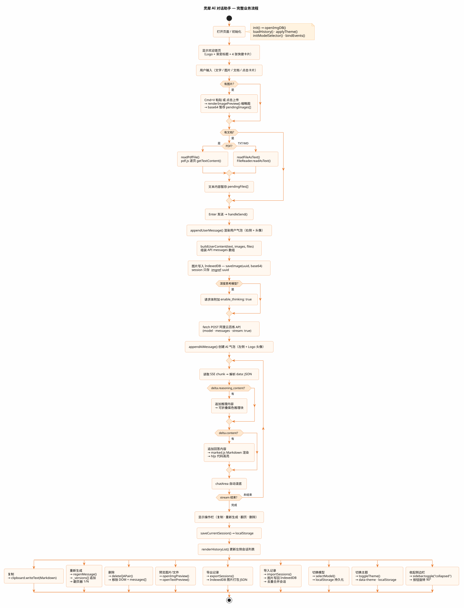

# 灵犀 AI 对话助手 - Week01 作业


## 项目基本信息

| 字段 | 内容 |
|------|------|
| 姓名 | 吴汉东 |
| 学校 | 中国地质大学（武汉） |
| 学号 | 20231003912 |
| 项目 | 仿 WPS 灵犀风格 AI 对话助手 |
| 技术栈 | HTML + CSS + Vanilla JS（无框架） |
| 模型接入 | 阿里云百炼（qwen-vl-plus / qwen-plus / qwen3-235b-a22b 等多模型） |
| 启动方式 | VS Code Live Server 打开 `lingxi/index.html` |

---

## 开发任务索引

### 基础要求（老师要求）

| # | 功能 | 状态 |
|---|------|------|
| 1 | 欢迎首页（渐变标题 + 4 张快捷卡片，点击发送） | ✅ |
| 2 | AI 对话（接入阿里云百炼，流式输出打字机效果） | ✅ |
| 3 | Markdown 渲染（标题/表格/代码块/列表/引用） | ✅ |
| 4 | 代码块语法高亮 + 一键复制 | ✅ |
| 5 | 深色 / 浅色主题切换（刷新保持） | ✅ |
| 6 | 图片上传与预览 | ✅ |
| 7 | 停止生成按钮（AbortController 中断流式请求） | ✅ |
| 8 | 清除全部对话按钮（回到首页状态） | ✅ |
| 9 | Enter 发送 / Shift+Enter 换行快捷键 | ✅ |
| 10 | API Key 本地存储（key: `LINGXI_API_KEY`，不提交） | ✅ |

### 扩展功能（自主实现）

| # | 功能 | 状态 |
|---|------|------|
| 11 | 文档上传与识别（TXT / MD / PDF，pdf.js 解析） | ✅ |
| 12 | Cmd+V / Ctrl+V 粘贴图片到输入框 | ✅ |
| 13 | 多模型切换（通用 / 视觉 / 深度思考，localStorage 持久化） | ✅ |
| 14 | 深度思考模式（reasoning_content 可折叠推理块） | ✅ |
| 15 | 左侧边栏收起 / 展开（旋转动画 + 0.28s 滑动） | ✅ |
| 16 | 多会话管理（新建 / 切换 / 自动命名） | ✅ |
| 17 | 会话删除（单条 hover 删除 + 多选批量删除） | ✅ |
| 18 | 聊天记录导出（含图片，打包为 JSON 下载） | ✅ |
| 19 | 聊天记录导入（去重合并，图片写回 IndexedDB） | ✅ |
| 20 | 图片持久化（IndexedDB，绕过 localStorage 5MB 限制） | ✅ |
| 21 | 图片 / 文件 Lightbox 全屏预览 | ✅ |
| 22 | AI 回复操作栏（复制 / 重新生成 / 翻页 / 删除一问一答） | ✅ |
| 23 | 自定义品牌 Logo + 橙色系配色 | ✅ |
| 24 | 用户 / AI 自定义头像（me.jpg / LOGO-little.png） | ✅ |
| 25 | 浏览器标签页 favicon + 自定义标题 | ✅ |

---

## 核心技术实现

### 1. 流式输出 + 打字机效果
使用 `fetch` + `ReadableStream` 逐块读取 SSE 数据，解析 `data:` 行后提取 `delta.content`，实时追加到 DOM，同时用 `marked.js` 增量渲染 Markdown。

### 2. 图片持久化（IndexedDB）
`localStorage` 有 5MB 上限，图片 base64 改存 IndexedDB（`lingxi-images` 库）。会话 JSON 里只保存 `__imgref__:<uuid>` 引用，加载时异步从 DB 取回还原。导出时把所有引用图片打包进 JSON 的 `images` 字段，导入时先写回 DB 再恢复会话。

### 3. 多模型 + 深度思考
顶栏下拉框分三组（通用 / 视觉 / 深度思考），选中模型存 `localStorage`。深度思考模型请求体自动附加 `enable_thinking: true`，响应中 `delta.reasoning_content` 渲染为可折叠的紫色推理块。

### 4. PDF 解析
引入 CDN 版 `pdf.js`，`readPdfFile` 逐页调用 `page.getTextContent()` 拼接文字，作为系统上下文注入消息。

### 5. AI 回复版本管理
每条 AI 消息维护 `_versions[]` 数组，重新生成时追加新版本，翻页器显示 `‹ 1/2 ›`，各版本独立存储原始 Markdown。

### 6. 会话管理
会话列表存 `localStorage`（key: `lingxi-sessions`），每条会话含 `id / title / messages / model / createdAt`。切换会话时异步从 IndexedDB 还原图片引用，保证图片正常显示。

---

## 设计思路与流程图

本项目以"轻量、可扩展、体验接近原生 App"为核心设计原则，整体分为三层：

**1. 数据层**
- 会话列表和模型配置存 `localStorage`，轻量且无需后端
- 图片 base64 单独存 `IndexedDB`，绕过 5MB 限制，session 只存 `__imgref__:uuid` 引用，保持 JSON 精简
- 导出时将 IndexedDB 图片打包进 JSON，实现完整的离线备份与恢复

**2. 通信层**
- 使用 `fetch` + `ReadableStream` 对接阿里云百炼 SSE 流式接口，逐 chunk 解析 `data:` 行
- 深度思考模型额外监听 `delta.reasoning_content`，与正文内容分流渲染
- `AbortController` 实现随时中断生成

**3. 渲染层**
- `marked.js` 解析 Markdown，`highlight.js` 做代码高亮，两者配合实现富文本回答
- 每条 AI 消息维护 `_versions[]` 版本数组，支持重新生成后翻页对比
- 主题切换通过 CSS 变量 + `data-theme` 属性实现，无需重载页面



---

## 项目结构

```
week01/homework/lingxi/
├── index.html              # 主页面（Live Server 入口）
├── assets/
│   ├── LOGO-little.png     # 品牌 Logo（橙色系，透明背景）
│   ├── 灵犀AI.png           # 侧边栏字体 Logo
│   ├── me.jpg              # 用户头像
│   └── 流程图.svg           # 项目流程图
├── css/
│   └── index.css           # 全局样式 + 深色/浅色主题 CSS 变量
└── js/
    └── index.js            # 全部业务逻辑（~1250 行，无框架）
```

---

## 使用说明

1. 用 VS Code Live Server 打开 `lingxi/index.html`
2. 首次使用点击右上角 🔑 图标，输入阿里云百炼 API Key（存入 `LINGXI_API_KEY`）
3. 顶栏下拉框切换模型（视觉模型支持图片上传，深度思考模型显示推理过程）
4. 支持 Cmd+V / Ctrl+V 直接粘贴图片到输入框
5. 聊天记录可通过侧边栏底部「导出」按钮保存为 JSON，「导入」按钮恢复（含图片）

---

## 遇到的问题与解决思路

| 问题 | 解决方案 |
|------|----------|
| localStorage 存图片超 5MB 报错 | 改用 IndexedDB 存储 base64，session 只存引用 id |
| 导出 JSON 导入后图片不显示 | 导出时把 IndexedDB 图片打包进 JSON，导入时先写回 DB |
| 深度思考模型 reasoning_content 与正文混排 | 分别监听两个字段，推理内容单独渲染为可折叠块 |
| PDF 文字提取乱序 | 用 pdf.js 逐页 getTextContent，按 transform.y 排序文字块 |
| 粘贴图片时文件名被写入输入框 | paste 事件先 preventDefault 再处理 items |
