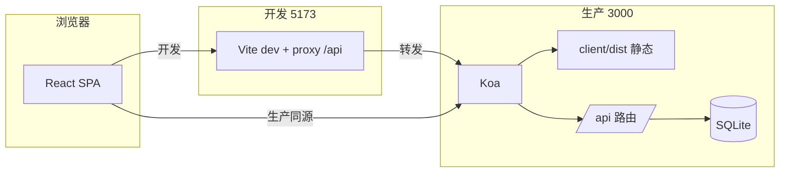

# 在线学习管理平台 — Week03 作业

## 项目基本信息

| 字段 | 内容 |
|------|------|
| 姓名 | 吴汉东 |
| 学校 | 中国地质大学（武汉） |
| 学号 | 20231003912 |
| 项目 | 在线学习管理平台（前后端分离 + 生产环境一体化托管） |
| 前端 | Vite 8、React 19、TypeScript、Ant Design 6、Recharts、react-markdown、axios |
| 后端 | Node.js（ESM）、Koa 2、`@koa/router`、better-sqlite3、jsonwebtoken、bcryptjs |
| 测试账号 | `admin` / `admin123`（与作业要求一致） |
| 开发访问 | 前端 `http://localhost:5173`，Vite 将 `/api` **代理**到 `http://localhost:3000` |
| 生产访问 | `npm run build` 后由 Koa 托管 `client/dist`，浏览器打开 **`http://localhost:3000`** |

---

## 开发任务索引

### 基础要求（对照《作业2要求》二、三、四、五）

| # | 要求摘要 | 实现说明 | 状态 |
|---|----------|----------|------|
| 1 | 登录（用户名+密码）、未登录跳转登录页 | `POST /api/auth/login`；`App.tsx` 中 `RequireAuth` / `GuestOnly`；JWT 存 `localStorage` | ✅ |
| 2 | 工作台 4 统计卡 + 4 图表 | `GET /api/dashboard` 聚合；前端 `DashboardPage` + Recharts（柱状/折线/双饼图） | ✅ |
| 3 | 课程列表：分页默认 10、可改条数、搜索/筛选 | `CoursesPage` + `GET /api/courses` 查询参数 | ✅ |
| 4 | 选课人数列 **服务端排序** | 后端 `sortField` / `sortOrder` + **白名单字段**，避免拼接 SQL 注入 | ✅ |
| 5 | 课程增删改、发布/草稿、删除 Popconfirm | `POST/PUT/DELETE/PATCH` 系列接口；表格内 `Switch` + `Popconfirm` | ✅ |
| 6 | 学生列表：分页、搜索、筛选、**多选课程** | `StudentsPage`；`course_ids` JSON 存储；表单多选 | ✅ |
| 7 | 学生增删改 | `students.js` 中 `POST` / `PUT` / `DELETE` 完整实现 + 学号唯一校验 | ✅ |
| 8 | 学习总结：服务端 Markdown、前端渲染 | `server/data/summary.md`；`GET /api/summary`；`SummaryPage` + `react-markdown` | ✅ |
| 9 | 前端技术栈：Vite + React + TS + Ant Design，**禁止** Umi / 飞冰 / Pro 等脚手架 | 手写路由与布局，无集成脚手架 | ✅ |
| 10 | 后端：Koa + Router + SQLite + JWT | `server/src` 模块化路由；`authenticateToken` 中间件 | ✅ |
| 11 | 开发：`5173` + Vite **代理** `/api` → `3000` | `client/vite.config.ts` 中 `server.proxy` | ✅ |
| 12 | 生产：Koa 托管 `client/dist` + SPA 回退 | `server/src/index.js` 静态文件与 `index.html` 回退 | ✅ |
| 13 | 提交 `client/dist` | 按作业要求打包后提交（批改与生产一致） | ✅ |

### 扩展功能（自主实现，便于展示工程完整性）

| # | 功能 | 状态 |
|---|------|------|
| 14 | 学习总结页 **在线编辑并保存**（`PUT /api/summary` 写回 `summary.md`） | ✅ |
| 15 | Markdown 中 **相对路径图片**：`/api/static` 安全读取 `server/data` 下资源；并处理 SPA 子路由下 `/…/assets/…` 裂图 | ✅ |
| 16 | Markdown **代码块**语法高亮 + **一键复制**（`MarkdownCodeBlock.tsx` + react-syntax-highlighter） | ✅ |
| 17 | 课程分类 **AutoComplete**：支持从已有分类选，也可输入「新建分类：xxx」 | ✅ |
| 18 | 全局 **黏土风（Claymorphism）** 视觉：`client/src/index.css` 中 CSS 变量 + 卡片圆角阴影 | ✅ |
| 19 | 登录页左侧插画与 **缩放提示**（`localStorage` 记住「不再提示」） | ✅ |
| 20 | 学生/课程变更后 **`updateCourseCounts` 同步 `courses.student_count`**，保证仪表盘与排序数据一致 | ✅ |
| 21 | Axios 封装：`code !== 0` 抛错；**401 时排除 `/auth/login`**，避免登录失败被强制跳转首页 | ✅ |

### 与技术要求字面的差异说明（主动交代，减少误判）

| 作业文档写法 | 本项目做法 | 说明 |
|--------------|------------|------|
| 提到 Tailwind CSS | **未引入** Tailwind | 样式由 **CSS 变量 + BEM 风格类名**（`index.css`）完成，避免与 Ant Design Token 叠床架屋；功能与视觉要求已满足。若老师要求字面完全一致，可再集成 Tailwind。 |

---

## 核心技术实现

### 1. 路由级鉴权（未登录不可进业务页）

登录态以 `localStorage` 中的 `token` 为准。业务路由外包一层 `RequireAuth`，登录页用 `GuestOnly` 防止已登录用户重复进入。

> **搜索定位**：VS Code `Cmd+Shift+F` 搜索 `RequireAuth`

```tsx
// client/src/App.tsx
function RequireAuth({ children }: { children: ReactElement }) {
  return hasAuthToken() ? children : <Navigate to='/login' replace />;
}
function GuestOnly({ children }: { children: ReactElement }) {
  return hasAuthToken() ? <Navigate to='/' replace /> : children;
}
```

### 2. Axios 拦截器：JWT 附带 + 401 智能处理

请求统一 `baseURL: '/api'`，从 `localStorage` 读取 token 写入 `Authorization: Bearer …`。响应 401 时，**登录接口**仍把错误交给登录页展示；其余接口清 token 并跳转 `/login`。

> **搜索定位**：搜索 `path.includes('/auth/login')`

```ts
// client/src/lib/api.ts
instance.interceptors.response.use(
  (resp) => resp,
  (err) => {
    if (err.response?.status === 401) {
      const path = err.config?.url ?? '';
      if (!path.includes('/auth/login')) {
        localStorage.removeItem('token');
        window.location.href = '/login';
        return new Promise(() => {});
      }
    }
    return Promise.reject(err);
  }
);
```

### 3. 课程列表服务端排序（白名单防注入）

排序字段仅允许预置列名，`sortOrder` 仅允许 `ascend` / `descend`，再映射为 `ASC` / `DESC` 拼接进 SQL，**禁止**直接拼接前端传入的列名字符串。

> **搜索定位**：搜索 `allowedSortFields`

```js
// server/src/routes/courses.js
const allowedSortFields = ['student_count', 'lesson_count', 'created_at', 'name'];
let orderBy = 'ORDER BY created_at DESC';
if (sortField && allowedSortFields.includes(sortField) && ['ascend', 'descend'].includes(sortOrder)) {
  const dir = sortOrder === 'ascend' ? 'ASC' : 'DESC';
  orderBy = `ORDER BY ${sortField} ${dir}`;
}
```

### 4. 选课关系与 `student_count` 同步

学生在 `students.course_ids` 中以 JSON 数组保存所选课程 ID。每次增删改学生后调用 `updateCourseCounts()`，遍历课程统计选课人数并回写 `courses.student_count`，保证工作台图表与表格排序数据一致。

> **搜索定位**：搜索 `updateCourseCounts`

```js
// server/src/routes/students.js（节选）
function updateCourseCounts() {
  const courses = db.prepare('SELECT id FROM courses').all();
  const students = db.prepare('SELECT course_ids FROM students').all();
  for (const course of courses) {
    const count = students.filter(s => {
      const ids = JSON.parse(s.course_ids || '[]');
      return ids.includes(course.id);
    }).length;
    db.prepare('UPDATE courses SET student_count = ? WHERE id = ?').run(count, course.id);
  }
}
```

### 5. 生产环境：静态资源 + SPA 回退 + Markdown 图片路径修复

- 非 `/api` 的 GET 请求优先尝试 `client/dist` 下真实文件；不存在则返回 `index.html`，支持 React Router 前端路由。
- Markdown 中若使用 `./assets/xxx.png` 等形式，在子路由（如 `/summary`）下浏览器可能请求成 `/summary/assets/…` 而拿到 HTML。**`index.js` 中增加中间件**：将路径中含 `/assets/` 的安全相对请求映射到 `server/data/assets`，避免裂图。

> **搜索定位**：搜索 `Markdown 相对路径图片` 或 `ctx.path.indexOf('/assets/')`

### 6. Vite 开发代理

开发环境下前端只访问同源 `/api`，由 Vite 转发到 3000 端口后端，避免 CORS 与端口混用问题。

> **搜索定位**：`client/vite.config.ts` 中 `proxy: { '/api': … }`

### 7. 登录密码校验

用户密码以 bcrypt 哈希存储；登录时用 `bcrypt.compareSync` 校验，成功后签发 JWT（`expiresIn: '7d'`）。

> **搜索定位**：`server/src/routes/auth.js` 中 `bcrypt.compareSync`

---

## 设计思路与架构

整体分为四层，便于扩展与批改时快速定位：

**1. 接入层**  
Koa 挂载 `/api/*` 路由；静态资源与 SPA 回退；异常统一 catch 返回 `{ code, msg, data }` 结构。

**2. 安全与鉴权**  
除 `POST /api/auth/login` 外，业务接口使用 `authenticateToken` 解析 `Authorization: Bearer`。

**3. 数据层**  
SQLite 单文件数据库；课程、学生、用户、学习记录表；选课关系用 JSON 列简化多对多（作业规模下足够清晰）。

**4. 前端展示层**  
React Router 布局 `AppLayout`；列表页统一「筛选 + 分页 + 请求参数驱动 `useEffect` 拉数」；图表只消费 dashboard 聚合接口。



---

## 项目结构

```
week03/homework/course/
├── README.md                              # 本说明（提交必读）
├── 吴汉东_20231003912_在线学习管理平台.mp4   # 压缩后演示视频非常小（按作业命名）
├── client/
│   ├── package.json                       # npm run dev / build
│   ├── vite.config.ts                     # 5173、/api 代理
│   ├── dist/                              # 打包输出（作业要求提交）
│   └── src/
│       ├── App.tsx                        # 路由 + RequireAuth
│       ├── main.tsx
│       ├── index.css                      # 黏土风全局样式、CSS 变量
│       ├── components/                    # AppLayout、MarkdownCodeBlock、LoginVisualLeft 等
│       ├── pages/                         # Login、Dashboard、Courses、Students、Summary
│       └── lib/                           # api.ts、types、markdownAssets、zoomTipSession
└── server/
    ├── package.json                       # npm start
    ├── data/
    │   ├── summary.md                     # 学习总结（可编辑保存）
    │   └── assets/                        # Markdown 引用图片等静态资源
    └── src/
        ├── index.js                       # 入口：数据库初始化、路由、静态托管、SPA 回退
        ├── database/                      # db.js、init.js（建表与种子数据）
        ├── middleware/auth.js             # JWT 校验
        ├── routes/                        # auth、courses、students、dashboard、summary、static
        └── utils/response.js              # 统一 success / fail
```

---

## 使用说明

### 老师批改（与《作业2要求》「作业批改」一致）

```bash
cd week03/homework/course/client && npm i && npm run build
cd ../server && npm i && npm start
```

浏览器打开 **http://localhost:3000**，使用 `admin` / `admin123` 登录。

### 本地开发（双终端或先后台）

1. 终端 A：`cd server && npm i && npm start`（3000）  
2. 终端 B：`cd client && npm i && npm run dev`（5173）  
3. 访问 **http://localhost:5173**

### 学习总结与图片

- 文本内容：`server/data/summary.md`（页面内也可编辑保存）。  
- Markdown 中引用本地图：建议放在 `server/data/assets/`，写法如 ``，由 `/api/static` 或回退中间件提供访问。

---

## 遇到的问题与解决思路

### 1. 登录失败也返回 401，被全局拦截器当成「未登录踢出」

**现象**：输错密码时页面异常跳转或错误信息不显示。  
**原因**：401 拦截器未区分登录接口与业务接口。  
**解决**：在响应拦截器中判断 URL 是否包含 `/auth/login`，登录请求仍 `reject` 交给表单展示。

> **搜索定位**：`api.ts` 中 `path.includes('/auth/login')`

### 2. 在 `/summary` 路由下 Markdown 相对路径图片 404 或显示成整页 HTML

**现象**：`src="./assets/a.png"` 实际请求变成 `/summary/assets/a.png`，被 SPA 回退成 `index.html`，图片「裂开」。  
**原因**：浏览器相对当前路由解析路径。  
**解决**：前端 `normalizeMarkdownImageSrc` 将错误路径改写为 `/api/static/...`；后端对 `…/assets/…` 的 GET 做专门映射到 `server/data/assets`。

> **搜索定位**：`markdownAssets.ts` 中 `normalizeMarkdownImageSrc`；`server/src/index.js` 中 `/assets/` 中间件

### 3. 选课人数与多选课程不一致

**现象**：改完学生选课后，课程表「选课人数」或柱状图未更新。  
**原因**：`student_count` 未随 `course_ids` 重算。  
**解决**：学生 `POST/PUT/DELETE` 末尾统一调用 `updateCourseCounts()`。

> **搜索定位**：`students.js` 中 `updateCourseCounts`

---

## 其他希望老师看到的内容

### 超出作业最低要求的部分

1. **学习总结可写回**：不仅展示 Markdown，还支持在系统内编辑并 `PUT` 保存，方便迭代个人总结。  
2. **Markdown 工程化**：代码高亮、复制按钮、图片路径在 SPA 下的兼容，接近真实文档站体验。  
3. **安全细节**：排序白名单、静态文件路径 `normalize` 防 `..` 穿越、`/api/static` 限制扩展名。  
4. **数据一致性**：选课人数由服务端根据全表学生重算，避免前后端各算各的。

### 学习收获

- 熟悉了 **JWT + 前端路由守卫** 的常见配合方式，以及 axios 拦截器里「例外路径」的处理。  
- 对 **better-sqlite3 同步 API** 在 Koa 中的组织方式有了完整实践（路由拆分、参数化查询）。  
- 体会到 **生产环境同源部署**（Koa 托管 dist）与开发代理的对应关系，减少部署后路径问题。

---
